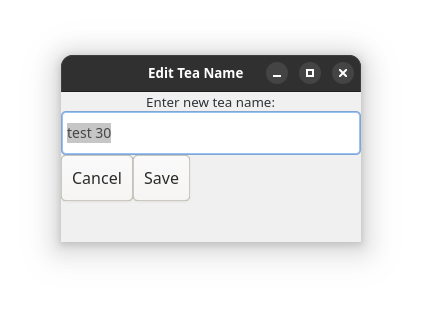

# Tea Logger
Built with C++ and Gtkmm (a cross-platform toolkit often used with GNOME), this project does not include platform specific build details. The project also features the use of SQLite3.

You can read more about Gtkmm here:

https://gtkmm.gnome.org/en/documentation.html

## Description of Project

Current look of the program:

https://github.com/user-attachments/assets/673f0af8-254f-4c26-97eb-26b8017a6876

Edit window:

### Current Features
- Add a tea by name
- Delete a tea by name
- Search a tea by name
- Edit and save an entry by selecting
  - *time edited not done currently*

### Planned Features/Short Goals
- ~~Edit entries~~
- Add more and detailed fields to be entered for a tea
  - Ex: Brand, Tea Type, Personal ratings...
- Flavor dictionary
  - First implementation would be a simple notes section.

### Long term goals
- Vizualize statistics (pie/bar charts) based on logs
  - Ex: A pie chart based off ratings... maybe someone will see they prefer Black Tea over most varieties.
- Track inventory of your current tea collection (when logged the program should subtract one from the database).
- Eventually webfacing or mobile interface?
